# AI Pet

AI Pet 是一个常驻桌面的 AI 宠物助手。它不是一个传统聊天窗口，而是一个会陪在屏幕边上的小团子：平时待机、睡觉、跟随鼠标互动；需要帮忙时可以聊天、搜索、记录提醒，也会用不同状态动画回应正在发生的事情。✨

这个项目希望把 AI 助手做得更轻、更近、更有陪伴感。它可以像桌面小伙伴一样停在角落，也可以吸附在屏幕左右边缘，尽量不打扰工作，同时在需要时主动冒出来提醒你。

## 展示 🖼️

### 正常

<p align="center">
  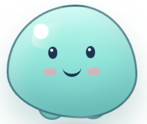
</p>

### 状态展示

<p align="center">
  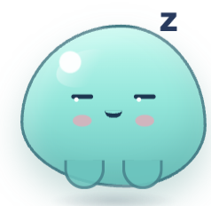
  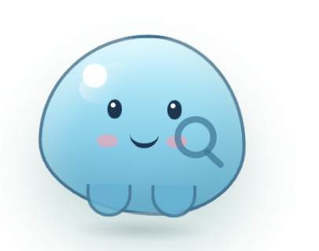
  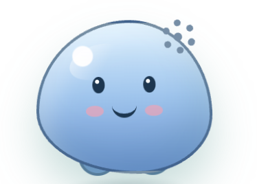
  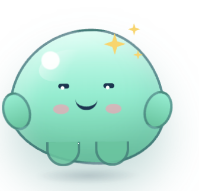
  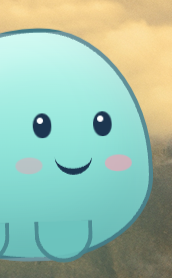
  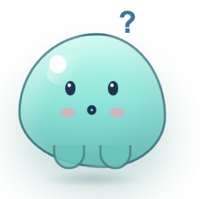
</p>

<p align="center">
  <sub>待机 · 搜索中 · 搜索结果 · 完成任务 · 边缘吸附 · 疑问</sub>
</p>

### 功能截图

<table>
  <tr>
    <td align="center" valign="middle" width="20%">
      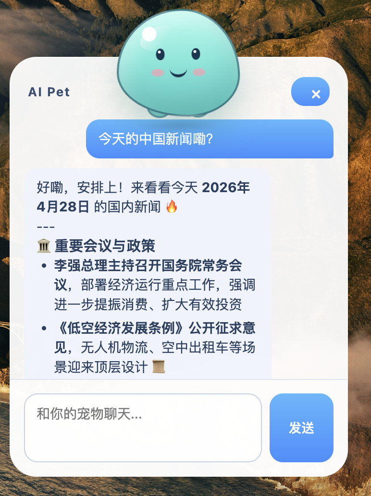
    </td>
    <td align="center" valign="middle" width="20%">
      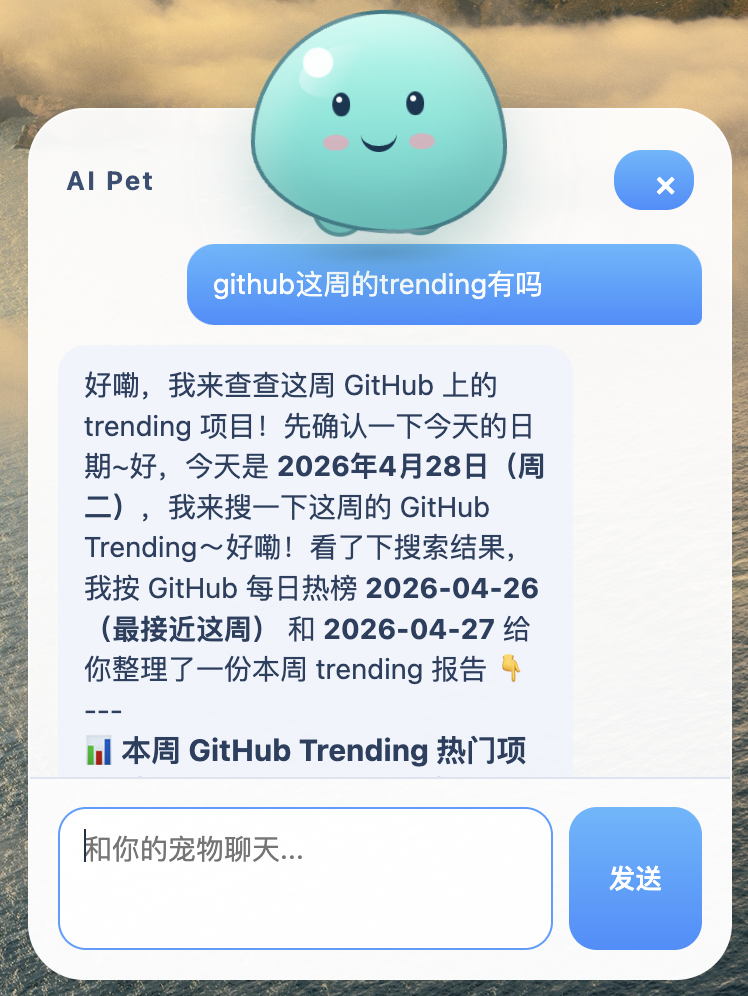
    </td>
    <td align="center" valign="middle" width="20%">
      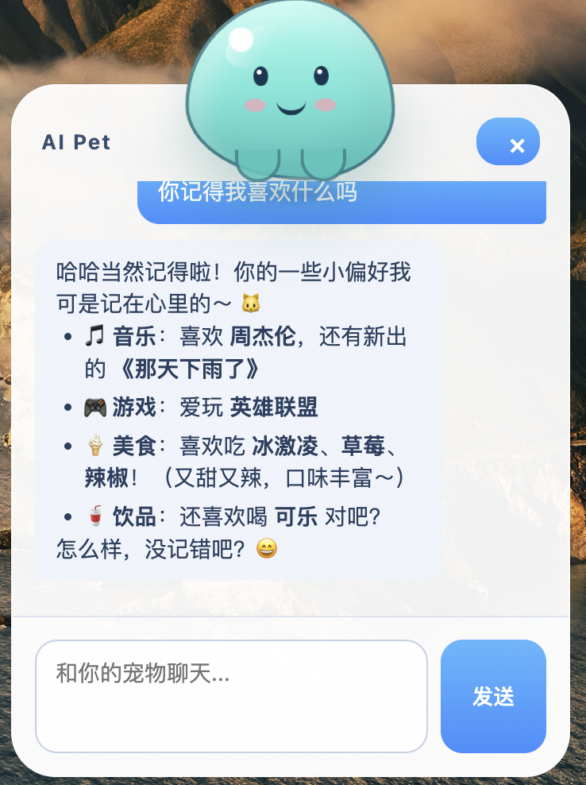
    </td>
    <td align="center" valign="middle" width="20%">
      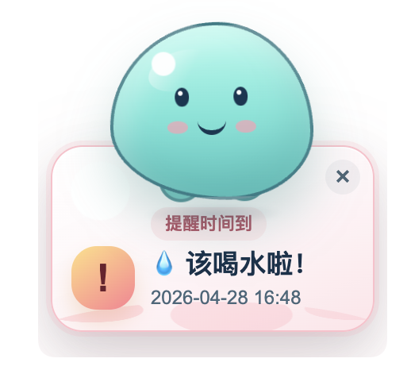
    </td>
    <td align="center" valign="middle" width="20%">
      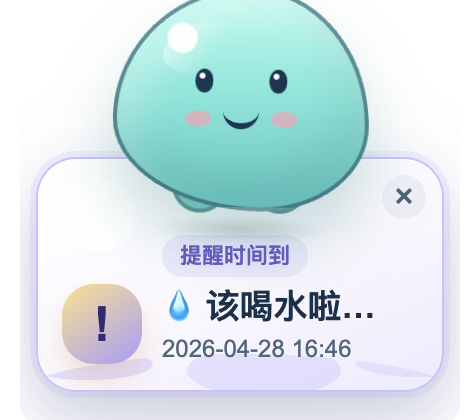
    </td>
  </tr>
</table>


## 它能做什么 💡

- 陪伴在桌面上：软体团子形象会在待机、思考、搜索、调用工具、完成任务、睡觉等状态之间切换。
- 自然聊天：可以像桌面助手一样和你对话，回答日常问题，也能根据上下文继续交流。
- 外部搜索：接入 MCP 搜索服务后，可以查询实时信息，例如新闻、人物动态、资料检索等。
- 提醒事项：可以通过自然语言创建提醒，到时间后在宠物旁边弹出提醒卡片。
- 记忆与技能：项目内置了面向长期使用的记忆与技能机制，可以逐步沉淀偏好、知识和可复用能力。支持外部skill扩展。
- 边缘吸附：拖动到屏幕左右两侧时，宠物会吸附到边缘，以更低打扰的方式陪在旁边。

## 适合的使用场景 🌿

- 工作时快速问问题，不想频繁切换浏览器或聊天应用。
- 需要一个轻量的桌面提醒，不希望提醒一来就弹出完整聊天窗口。
- 想让 AI 助手拥有更明显的“状态感”，知道它是在思考、搜索还是完成任务。
- 想尝试把 MCP、外部搜索、记忆、提醒和桌面交互结合在一个完整产品里。

## 当前体验 🧩

AI Pet 由两个主要界面组成：

- 桌面宠物：常驻屏幕，负责展示状态、动作、提醒和轻量互动。
- 聊天面板：点击宠物后打开，用来输入问题、查看回答和完成更复杂的交互。

当你询问需要实时信息的问题时，宠物会进入搜索状态；当提醒到期时，不会强行打开聊天面板，而是在宠物附近展示一张独立的提醒卡片。拖动宠物到屏幕左右边缘时，它会切换成侧边探出的姿态，保留眼睛和嘴巴可见。

## 项目特点 ✨

- 桌面优先：不是网页里的聊天机器人，而是贴近桌面工作流的常驻助手。
- 状态驱动：宠物形象会跟随 AI 当前行为变化，让等待过程更可感知。
- 工具可扩展：可以继续接入更多 MCP 服务，让宠物获得搜索、查询、自动化等新能力。
- 本地感强：提醒、记忆、技能和宠物交互围绕个人桌面环境设计。
- 轻量陪伴：默认不打断工作，只有在你点击、拖动、提问或提醒到期时才更明显地出现。

## 快速开始 🚀

首次使用前，请先运行 `npm install` 安装项目依赖，然后复制 `.env.example` 为 `.env`，填入模型服务所需的密钥和模型名称。需要外部搜索能力时，在 `mcp/servers.json` 中开启对应 MCP 服务。

启动桌面端：

```bash
npm run dev:desktop
```

启动 Python 服务：

```bash
npm run dev:python
```

## 后续计划 🌱

- 更丰富的宠物动作和情绪表现。
- 更完整的提醒管理界面。
- 更多 MCP 工具接入模板。
- 更细致的记忆和技能管理体验。
- 打包成更方便安装和日常使用的桌面应用。
